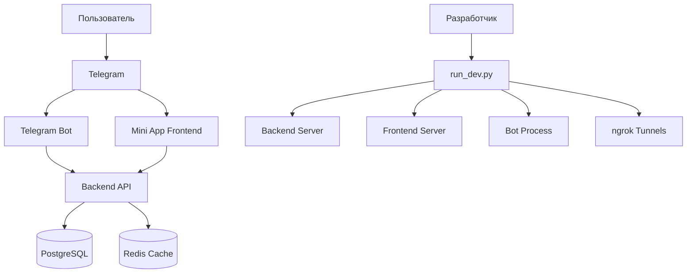

# 🛠️ Руководство по разработке

Подробное руководство для разработчиков, работающих с Telegram Mini App системой записи на тренировки.

## 🏗️ Архитектура системы

### Общая схема



### Компоненты системы

| Компонент | Технология | Порт | Описание |
|-----------|------------|------|----------|
| Backend API | FastAPI + SQLModel | 8000 | REST API, бизнес-логика |
| Frontend | HTML + CSS + JS | 3000 | Mini App интерфейс |
| Telegram Bot | aiogram 3.x | - | Обработка команд Telegram |
| Database | PostgreSQL/SQLite | 5432 | Хранение данных |
| Tunnels | ngrok | 4040 | HTTPS туннели для разработки |

## 🚀 Настройка среды разработки

### 1. Начальная настройка

```bash
# Клонирование репозитория
git clone <repository-url>
cd schedule-bot-1

# Создание виртуального окружения
python -m venv .venv
source .venv/bin/activate  # Linux/macOS
# или .venv\Scripts\activate  # Windows

# Установка зависимостей
pip install -r requirements.txt
```

### 2. Настройка конфигурации

#### Telegram Bot токен
```bash
# Создание файла с токеном
echo 'BOT_TOKEN = "YOUR_BOT_TOKEN"' > tg_bot/constants.py
```

#### ngrok настройка
```bash
# Установка ngrok
brew install ngrok  # macOS
# или скачайте с https://ngrok.com/download

# Настройка authtoken
ngrok config add-authtoken YOUR_TOKEN

# Проверка
python check_ngrok.py
```

### 3. Первый запуск

```bash
# Интерактивный запуск
python run_dev.py

# Или все сервисы сразу
python run_dev.py all
```

## 🔧 Система запуска разработки

### run_dev.py - основной скрипт

Новая система запуска обеспечивает:
- ✅ Автоматическое обновление конфигураций
- ✅ Цветные логи с префиксами
- ✅ Горячая перезагрузка всех сервисов
- ✅ Интерактивное меню выбора

### Команды запуска

```bash
# Интерактивное меню
python run_dev.py

# Все сервисы с ngrok
python run_dev.py all

# Локальная разработка (без ngrok)
python run_dev.py local

# Отдельные сервисы
python run_dev.py backend
python run_dev.py frontend
python run_dev.py bot
python run_dev.py ngrok

# Обновление конфигурации
python update_config.py
```

### Автоматические обновления

При запуске с ngrok обновляются:

1. **Backend CORS** (`backend/src/main.py`)
2. **Frontend API URL** (`frontend/config.js`)
3. **Bot Mini App URL** (`tg_bot/handlers/start.py`)
4. **Bot API URLs** (`tg_bot/api/*.py`)

## 📁 Структура кода

### Backend (FastAPI)

```
backend/src/
├── main.py              # Точка входа приложения
├── api/                 # API слой
│   ├── dependencies/    # Dependency injection
│   ├── endpoints/       # REST endpoints
│   └── routers.py       # Маршрутизация
├── models/              # Модели данных
│   ├── db/             # SQLModel модели БД
│   └── schemas/        # Pydantic схемы
├── repository/          # Слой доступа к данным
│   ├── crud/           # CRUD операции
│   ├── db.py           # Подключение к БД
│   └── migrations/     # Alembic миграции
├── services/            # Бизнес-логика
└── utilities/           # Утилиты и исключения
```

### Frontend (Vanilla JS)

```
frontend/
├── index.html          # Главная страница
├── styles.css          # CSS стили
├── app.js             # Основная логика
├── config.js          # Конфигурация
├── server.py          # Dev сервер
└── test_in_browser.html # Тестирование
```

### Telegram Bot (aiogram)

```
tg_bot/
├── main.py            # Точка входа бота
├── handlers/          # Обработчики команд
│   ├── start.py       # Команда /start
│   ├── timeslots.py   # Работа с расписанием
│   └── users.py       # Управление пользователями
├── keyboards/         # Inline клавиатуры
├── api/              # HTTP клиенты для API
├── middlewares/      # Мидлвары
├── states.py         # FSM состояния
└── config.py         # Конфигурация
```

## 🗄️ Работа с базой данных

### Модели данных

#### User (Пользователь)
```python
class User(SQLModel, table=True):
    id: Optional[int] = Field(primary_key=True)
    telegram_id: int = Field(unique=True)
    first_name: str
    second_name: Optional[str] = None
    age: Optional[int] = None
    phone_number: Optional[str] = None
    is_admin: bool = False
```

#### TimeSlot (Временной слот)
```python
class TimeSlot(SQLModel, table=True):
    id: Optional[int] = Field(primary_key=True)
    start_time: time
    end_time: time
    date: date
    weekday: str
```

#### Booking (Запись)
```python
class Booking(SQLModel, table=True):
    id: Optional[int] = Field(primary_key=True)
    user_id: int = Field(foreign_key="user.id")
    start_time: time
    end_time: time
    date: date
```

### Миграции

```bash
# Создание миграции
cd backend
alembic revision --autogenerate -m "Description"

# Применение миграций
alembic upgrade head

# Откат миграции
alembic downgrade -1
```

### CRUD операции

Все CRUD операции наследуются от базового класса:

```python
class CRUDBase(Generic[ModelType, CreateSchemaType, UpdateSchemaType]):
    def __init__(self, model: Type[ModelType]):
        self.model = model

    def get(self, session: Session, id: Any) -> Optional[ModelType]:
        return session.get(self.model, id)

    def create(self, session: Session, *, obj_in: CreateSchemaType) -> ModelType:
        # Реализация создания
        
    def update(self, session: Session, *, db_obj: ModelType, obj_in: UpdateSchemaType) -> ModelType:
        # Реализация обновления
```

## 🔌 API разработка

### Структура endpoints

```python
from fastapi import APIRouter, Depends
from ..dependencies import get_session

router = APIRouter(prefix="/api/bookings", tags=["bookings"])

@router.get("/", response_model=List[BookingRead])
def get_bookings(session: Session = Depends(get_session)):
    return booking_service.get_all(session)

@router.post("/", response_model=BookingRead)
def create_booking(
    booking: BookingCreate,
    session: Session = Depends(get_session)
):
    return booking_service.create(session, booking)
```

### Dependency Injection

```python
# dependencies/session.py
def get_session():
    with Session(engine) as session:
        yield session

# dependencies/repository.py
def get_user_repository(session: Session = Depends(get_session)):
    return UserRepository(session)
```

### Обработка ошибок

```python
# utilities/exceptions/booking.py
class BookingError(HTTPException):
    def __init__(self, detail: str):
        super().__init__(status_code=400, detail=detail)

class TimeSlotNotAvailableError(BookingError):
    def __init__(self):
        super().__init__("Выбранное время недоступно")
```

## 🎨 Frontend разработка

### Архитектура

Frontend построен на принципах:
- Модульность функций
- Разделение логики и представления
- Reactive обновления интерфейса

### Основные модули

```javascript
// app.js - основная структура
const App = {
    init() { /* инициализация */ },
    showBookingForm() { /* форма записи */ },
    showUserBookings() { /* записи пользователя */ },
    showTimeSlots() { /* доступное время */ }
};

// api.js - работа с API
async function apiRequest(endpoint, options = {}) {
    const response = await fetch(`${API_BASE_URL}${endpoint}`, {
        headers: {
            'Content-Type': 'application/json',
            'ngrok-skip-browser-warning': 'true'
        },
        ...options
    });
    return response.json();
}
```

### Telegram WebApp интеграция

```javascript
// Проверка среды Telegram
if (window.Telegram?.WebApp) {
    const tg = window.Telegram.WebApp;
    tg.ready();
    tg.expand();
    
    // Получение данных пользователя
    const user = tg.initDataUnsafe?.user;
    if (user) {
        currentUser = {
            id: user.id,
            first_name: user.first_name,
            last_name: user.last_name
        };
    }
}
```

### Стилизация

```css
/* Telegram-совместимые цвета */
:root {
    --tg-theme-bg-color: var(--bg-color, #ffffff);
    --tg-theme-text-color: var(--text-color, #000000);
    --tg-theme-button-color: var(--button-color, #007AFF);
    --tg-theme-button-text-color: var(--button-text-color, #ffffff);
}

/* Адаптивный дизайн */
.container {
    max-width: 100%;
    padding: 16px;
    margin: 0 auto;
}

@media (max-width: 480px) {
    .container {
        padding: 12px;
    }
}
```

## 🤖 Bot разработка

### Структура handlers

```python
from aiogram import Router, F
from aiogram.types import Message, CallbackQuery
from aiogram.filters import Command

router = Router()

@router.message(Command("start"))
async def start_command(message: Message):
    user_data = await get_or_create_user(message.from_user)
    await message.answer(
        "Добро пожаловать!",
        reply_markup=get_start_keyboard()
    )

@router.callback_query(F.data == "book_training")
async def book_training(callback: CallbackQuery):
    await callback.message.edit_text(
        "Выберите день:",
        reply_markup=get_days_keyboard()
    )
```

### States (FSM)

```python
from aiogram.fsm.state import State, StatesGroup

class BookingStates(StatesGroup):
    waiting_for_day = State()
    waiting_for_time = State()
    confirming_booking = State()
```

### Keyboards

```python
from aiogram.types import InlineKeyboardMarkup, InlineKeyboardButton

def get_days_keyboard():
    keyboard = InlineKeyboardMarkup(inline_keyboard=[
        [InlineKeyboardButton(text="Понедельник", callback_data="day_monday")],
        [InlineKeyboardButton(text="Вторник", callback_data="day_tuesday")],
        # ...
    ])
    return keyboard
```

### API интеграция

```python
# api/timeslots.py
import httpx
from ..config import API_BASE_URL

async def get_available_timeslots(date: str):
    async with httpx.AsyncClient() as client:
        response = await client.get(f"{API_BASE_URL}/timeslots/available/{date}")
        return response.json()
```

## 🧪 Тестирование

### Структура тестов

```
tests/
├── backend/
│   ├── test_api/        # Тесты API endpoints
│   ├── test_services/   # Тесты бизнес-логики  
│   └── test_crud/       # Тесты CRUD операций
├── frontend/
│   └── test_ui/         # UI тесты
└── integration/         # Интеграционные тесты
```

### Тестирование API

```python
import pytest
from fastapi.testclient import TestClient
from backend.src.main import app

client = TestClient(app)

def test_create_booking():
    response = client.post("/api/bookings/", json={
        "user_id": 1,
        "start_time": "10:00",
        "end_time": "11:30",
        "date": "2024-01-15"
    })
    assert response.status_code == 200
    assert "id" in response.json()
```

### Тестирование бота

```python
import pytest
from aiogram.types import Message
from unittest.mock import AsyncMock

@pytest.mark.asyncio
async def test_start_command():
    message = AsyncMock(spec=Message)
    message.from_user.id = 123456
    
    await start_command(message)
    
    message.answer.assert_called_once()
```

## 📊 Мониторинг и логирование

### Логирование

Система использует structured logging:

```python
import structlog

logger = structlog.get_logger()

# В handlers
logger.info("User created booking", user_id=user.id, booking_id=booking.id)

# В API
logger.error("API error", endpoint="/bookings", error=str(e))
```

### Просмотр логов

```bash
# Все логи
python view_logs.py

# Конкретный сервис
python view_logs.py -s backend

# Реальное время
python view_logs.py -f backend.log

# Последние N строк
python view_logs.py -t 100
```

### Диагностика

```bash
# Полная диагностика системы
python diagnose.py

# Проверка ngrok
python check_ngrok.py

# Очистка данных для тестирования
python clear_timeslots.py
```

## 🔄 Workflow разработки

### 1. Создание новой функции

```bash
# Создание ветки
git checkout -b feature/new-booking-logic

# Разработка
# 1. Добавить модель в backend/src/models/
# 2. Создать CRUD операции в backend/src/repository/crud/
# 3. Добавить сервис в backend/src/services/
# 4. Создать API endpoint в backend/src/api/endpoints/
# 5. Обновить frontend в frontend/app.js
# 6. Добавить обработчик в tg_bot/handlers/
```

### 2. Тестирование

```bash
# Запуск тестов
pytest backend/tests/

# Проверка типов
mypy backend/src/

# Линтинг
flake8 backend/src/
black backend/src/

# E2E тестирование
python run_dev.py all
# Ручное тестирование в Telegram
```

### 3. Отладка

```bash
# Запуск с дебагом
python run_dev.py backend
# В другом терминале
python view_logs.py -f backend.log

# Проверка API
curl -X GET "http://localhost:8000/api/docs"

# Тестирование конкретного endpoint
curl -X POST "http://localhost:8000/api/bookings/" \
  -H "Content-Type: application/json" \
  -d '{"user_id": 1, "date": "2024-01-15", "start_time": "10:00", "end_time": "11:30"}'
```

## 📚 Best Practices

### Backend

1. **Используйте типизацию**
   ```python
   def create_booking(session: Session, booking_data: BookingCreate) -> Booking:
   ```

2. **Валидация данных**
   ```python
   class BookingCreate(BaseModel):
       user_id: int = Field(gt=0)
       date: date = Field(ge=date.today())
   ```

3. **Обработка ошибок**
   ```python
   try:
       booking = create_booking(session, booking_data)
   except ValueError as e:
       raise HTTPException(status_code=400, detail=str(e))
   ```

### Frontend

1. **Модульная структура**
   ```javascript
   const BookingModule = {
       create: async (data) => { /* логика */ },
       validate: (data) => { /* валидация */ },
       render: (booking) => { /* отображение */ }
   };
   ```

2. **Обработка ошибок**
   ```javascript
   try {
       const result = await apiRequest('/bookings', { method: 'POST', body: JSON.stringify(data) });
   } catch (error) {
       showError('Ошибка при создании записи');
   }
   ```

### Bot

1. **Использование FSM**
   ```python
   @router.callback_query(BookingStates.waiting_for_time)
   async def process_time_selection(callback: CallbackQuery, state: FSMContext):
   ```

2. **Валидация пользователя**
   ```python
   async def ensure_user_exists(user_id: int) -> User:
       user = await get_user(user_id)
       if not user:
           raise UserNotFoundError(f"User {user_id} not found")
       return user
   ```

## 🚀 Оптимизация

### База данных

```sql
-- Индексы для ускорения запросов
CREATE INDEX idx_timeslot_date ON timeslot(date);
CREATE INDEX idx_booking_user_id ON booking(user_id);
CREATE INDEX idx_user_telegram_id ON "user"(telegram_id);
```

### API

```python
# Кеширование с Redis
from redis import Redis
redis_client = Redis()

@lru_cache(maxsize=100)
def get_available_timeslots(date: str):
    # Кешированный запрос
    pass
```

### Frontend

```javascript
// Debounced поиск
const searchDebounced = debounce(searchFunction, 300);

// Lazy loading
const lazyLoad = (element) => {
    const observer = new IntersectionObserver((entries) => {
        entries.forEach(entry => {
            if (entry.isIntersecting) {
                loadContent(entry.target);
            }
        });
    });
    observer.observe(element);
};
```

## 🔗 Полезные команды

```bash
# Разработка
python run_dev.py                # Интерактивный запуск
python run_dev.py all           # Все сервисы
python run_dev.py local         # Без ngrok

# Диагностика
python diagnose.py              # Проверка системы
python check_ngrok.py           # Проверка ngrok
python view_logs.py             # Просмотр логов

# Утилиты
python clear_timeslots.py       # Очистка данных
python update_config.py         # Обновление конфигурации

# Тестирование
pytest backend/tests/           # Backend тесты
curl localhost:8000/api/docs    # Проверка API
```

Это руководство поможет быстро включиться в разработку и понять архитектуру проекта. При возникновении вопросов обращайтесь к соответствующим разделам документации или используйте команды диагностики. 